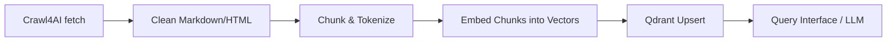

# Executive Summary

Crawl4AI is an **open-source, AI-focused web crawler** designed to produce clean, structured data (Markdown/JSON) for LLM pipelines. It renders JavaScript-heavy pages via headless browsers, prunes boilerplate, and supports configurable crawling (simple or deep) and data extraction (CSS/XPath or LLM-based)【5†L219-L228】【53†L87-L95】.  It offers both **synchronous (real-time) and asynchronous (job queue)** APIs. For example, a POST to `/crawl/job` accepts a list of URLs and returns a task ID for batch crawling【23†L1216-L1224】【18†L1233-L1242】.  Clients poll `GET /job/{id}` (or use webhooks) to retrieve results (Markdown content, extracted JSON, links) once done【23†L1294-L1302】【18†L1310-L1318】. 

In a RAG pipeline, Crawl4AI handles the **Fetch→Extract** stage: it fetches pages, executes JS, and outputs cleaned Markdown and structured fields.  These outputs then feed your normal **Chunk→Embed→Upsert** steps.  The planner should persist key fields (URL, title, text, etc.) as metadata alongside each vector. Robust ingestion of ~100 URLs can use batch jobs (e.g. one `/crawl/job` for 100 links or multiple parallel jobs), with `cache_mode` control, retry/backoff on 429/503, and ETag hashing to avoid reprocessing unchanged content.  Operationally, self-hosted Crawl4AI provides a **Docker container** (run with e.g. `docker run -d -p 11235:11235 crawl4ai:latest`【16†L381-L389】) and an interactive monitoring dashboard (`/monitor`) for system health【39†L2033-L2040】. 

Crawl4AI’s limitations include potential **bot blocks or CAPTCHAs** (mitigated by its built-in anti-bot retries and proxy support【48†L118-L120】), and difficulties with pages behind logins (solvable via custom hooks).  Developers should respect legal/ethical constraints (robots.txt, terms of service) when crawling. 

**Main recommendations:** Use `/crawl/job` for batch ingestion (vs `/crawl` for single-request), set `cache_mode: bypass` on first fetch, configure retries/backoff, and schedule periodic re-crawls.  Store each chunk’s `text`, `url`, `title`, `fetchTimestamp` and a hash for deduplication.  Below is a detailed guide with API tables, JSON examples, and a checklist.

---

## 1. Crawl4AI Overview: What & How It Works

- **AI-Ready Crawler:** Crawl4AI is a web crawler “built specifically with RAG pipelines in mind”【5†L219-L228】. It renders JavaScript (via Playwright) and cleans pages into **clean Markdown or JSON**. For example, RapidSeedBox notes it “spit[s] out clean Markdown or JSON, spin[s] up a real browser when needed… and slip[s] through proxies”【54†L62-L66】. Outputs include main text, headings, tables, links, images, and optional structured data.
- **Architecture:** Under the hood, Crawl4AI uses an async **browser pool** with stealth and proxy support. It applies content filters and markdown generators to prune ads, headers, and footers. Core components include:
  - **Simple vs Deep Crawling:** A *simple crawl* (`arun()` or `/crawl` endpoint) fetches one page. A *deep crawl* uses strategies (like BFS) to follow links up to a max depth【29†L124-L132】. Deep crawls return a list of results (one per page) with metadata (e.g. depth).
  - **Multi-URL Crawling:** For many pages, use `arun_many()` (parallel dispatcher) or the async job API. Multi-URL dispatchers handle concurrency, rate-limiting and memory-based pausing【11†L100-L107】. For example, docs recommend `arun_many()` “with proper concurrency control” for crawling many URLs【11†L100-L107】.
  - **Extraction Strategies:** Crawl4AI supports several:
    - **Default (LLM-free):** Generates Markdown using DOM parsing (e.g. `DefaultMarkdownGenerator`)【7†L135-L144】.
    - **Schema/JSON Extraction:** E.g. `JsonCssExtractionStrategy` to extract structured fields via CSS selectors or JSON schema【23†L1235-L1244】.
    - **LLM-based:** Can use an LLM to parse the page (via `/llm/job`).
- **Outputs & Formats:** The crawler yields:
  - `markdown`: raw and “fit” Markdown of main content【7†L135-L144】.
  - `html` / `cleaned_html`: raw/filtered HTML.
  - `extracted_content`: JSON object per schema if used.
  - `media` and `links`: lists of images/videos and links found.
  - Metadata like `url`, HTTP status, and optional fields (e.g. `metadata.title` if extracted)【46†L131-L139】【50†L1-L4】.
  - The output is explicitly **LLM-friendly**; e.g. a dev.to tutorial highlights that Crawl4AI “generates clean Markdown-formatted data, perfect for retrieval-augmented generation (RAG)”【53†L87-L95】.

【54†L62-L70】 *Figure: Crawl4AI can run a browser to fetch any URL, apply filters/pruning, and output structured JSON or Markdown (per above).*

---

## 2. Crawl4AI APIs & Endpoints

Crawl4AI’s **Docker server** exposes REST endpoints. Key endpoints include:

| Endpoint          | Method | Sync/Async  | Description                              |
|-------------------|:------:|:-----------:|------------------------------------------|
| `/crawl`          | POST   | Synchronous | Fetch one or many URLs immediately. Returns JSON with `results` array (each `CrawlResult`)【41†L902-L910】. Use `"urls": ["..."]` in body. Good for small jobs. |
| `/crawl/stream`   | POST   | Streaming   | Like `/crawl` but streams incremental results as NDJSON. Suitable for many URLs or long crawls; client reads line-by-line【39†L1970-L1979】. |
| `/crawl/job`      | POST   | Async job   | Submit list of URLs for background crawling. Returns `{"task_id": "...", "message": "Crawl job submitted"}`【23†L1227-L1236】【23†L1257-L1260】. Can include `webhook_config`. |
| `/llm/job`        | POST   | Async job   | Request LLM-based extraction of page. Provide `url`, `q` (question/prompt), LLM `provider`, and JSON `schema`. Returns a task ID【18†L1262-L1271】【18†L1275-L1284】. |
| `/job/{task_id}`  | GET    | Sync check  | Poll a submitted job. Returns status (`processing`/`completed`/`failed`). On completion, includes `result` with fields (`markdown`, `extracted_content`, `links`)【23†L1294-L1302】【23†L1309-L1317】. |
| `/html`           | POST   | Sync        | Returns pre-processed HTML for schema scraping. Body: `{"url": "..."}.` |
| `/screenshot`     | POST   | Sync        | Captures full-page PNG screenshot (optional `screenshot_wait_for`, `output_path`). |
| `/pdf`            | POST   | Sync        | Generates PDF (specify `output_path`). |
| `/execute_js`     | POST   | Sync        | Runs JS snippets on a page and returns full result (used for dynamic content). |

**Sync vs Async:**  
- **/crawl** (sync) blocks until crawl finishes (may timeout on long crawls). Good for quick fetch of a few pages.  
- **/crawl/stream** uses HTTP streaming (NDJSON) for progressive results. Client reads each JSON line as it completes. Example [39] shows an async client reading `response.aiter_lines()` until a `{"status":"completed"}` marker.  
- **/crawl/job** (async) immediately returns `task_id`. Client then polls `GET /job/{task_id}` or uses webhooks for completion. This is ideal for batch or long crawls【23†L1216-L1224】. It “has no timeout concerns for long operations” and suits microservices【23†L1216-L1224】.

**Request/Response Shapes:**  
- */crawl (sync)* request example (JSON body):  
  ```json
  { 
    "urls": ["https://example.com/privacy"],
    "hooks": { /* optional JS hooks */ },
    "crawler_config": { "cache_mode": "bypass" }
  }
  ```  
  Response (200 OK):  
  ```json
  {
    "results": [
      {
        "url": "https://example.com/privacy",
        "status_code": 200,
        "success": true,
        "markdown": "# Privacy Policy\n...\n",
        "extracted_content": { /* if schema used */ },
        "links": { ... },
        "media": { ... }
      }
    ]
  }
  ```
- */crawl/job (async)* request example:  
  ```json
  {
    "urls": ["https://example.com/privacy", "https://example.com/terms"],
    "cache_mode": "bypass",
    "extraction_strategy": {
      "type": "JsonCssExtractionStrategy",
      "schema": { "title": "h1", "content": ".content" }
    },
    "webhook_config": { "webhook_url": "https://app/myhook", "webhook_data_in_payload": true }
  }
  ```  
  Response:  
  ```json
  {
    "task_id": "crawl_1698765432",
    "message": "Crawl job submitted"
  }
  ```  
  Later, poll with `GET /job/crawl_1698765432`:  
  - **In-progress:** `{"task_id":"crawl_...","status":"processing","message":"Job is being processed"}`
  - **Completed:** `{"task_id":"crawl_...","status":"completed","result":{"markdown":"# Example...","extracted_content":{...},"links":{...}}}`【23†L1294-L1302】【23†L1310-L1317】.  

**Webhooks:** The job API supports webhooks (with retries/backoff). On success, Crawl4AI POSTs your `webhook_url` with JSON like:  
```json
{
  "task_id":"crawl_1698765432",
  "task_type":"crawl",
  "status":"completed",
  "timestamp":"2025-10-22T12:30:00Z",
  "urls":["https://example.com/privacy"],
  "data": {
    "markdown": "# Page content...",
    "extracted_content": { ... },
    "links": { ... }
  }
}
```  
Failure payloads include `"status":"failed"` and an `error` field【23†L1357-L1366】【23†L1369-L1377】. Delivery retries use exponential backoff【23†L1379-L1390】.

**Error Modes:**  
- Synchronous requests (`/crawl`) may return HTTP errors or truncated results if time out. Always check `success` and `status_code`.  
- Async jobs return `"status":"failed"` with `error_message` if any attempt fails beyond retries. For bot blocks (e.g. CAPTCHA), Crawl4AI sets `success=false` and notes the block reason【48†L118-L120】.

---

## 3. Extraction & Crawl Capabilities

Crawl4AI goes beyond basic scraping:

- **Clean Markdown Output:** By default it produces structured Markdown. Headers, lists, tables, and text are preserved in the output. This removes site noise (headers, ads) while keeping semantics (headings become `#`, lists, etc.). As dev.to notes, it generates “clean Markdown-formatted data, perfect for RAG”【53†L87-L95】. The `result.markdown` field contains both raw and filtered Markdown.
- **Schema/JSON Extraction:** You can request specific fields via the JSON extraction API (as shown in `/crawl/job` above). For instance, extracting article metadata (`title`, `content`) via CSS selectors or JSON schema. The result appears in `extracted_content`. 
- **Heading & Table Extraction:** Markdown output naturally captures headings (`<h*>`) and tables (`<table>`). Moreover, the v0.7.4 release notes (Crawl4AI blog) highlight “LLM-powered table extraction”【10†L142-L146】, meaning it can use an LLM to parse tables into JSON.  
- **Metadata (e.g. Last-Updated):** While Crawl4AI doesn’t auto-add “last_updated”, you can extract such data with a schema. You might fetch `<time>` tags via CSS. The `CrawlResult.metadata` dict may contain title/author if using an extraction strategy or auto-detected (e.g. from `<title>` or `<meta>` tags)【50†L1-L4】.
- **Media & Links:** By default, all images/videos found are listed under `media` (with URLs) and all in-page links under `links`. Useful to track assets. 
- **JavaScript Handling:** Crawl4AI fully renders pages with a real browser. It can handle SPAs and dynamic content. You can inject JS or wait for elements (via “hooks” or the `/execute_js` endpoint). For heavily scripted sites, this ensures you capture the final DOM.
- **Anti-Bot & Retry:** Crawl4AI includes a **bot-detection** fallback system. If it sees Cloudflare blocks, CAPTCHAs, or 403/429, it will retry (up to `max_retries`) with different proxies (if configured)【48†L100-L109】【48†L118-L120】. On exhaustion, it returns a failed `CrawlResult`. This is crucial for resistant sites.
- **Limitations:**  
  - *Login/JS Challenges:* For sites requiring login, use **hooks** to supply credentials/cookies (example in [33] shows a GitHub login hook).  
  - *Rate Limiting:* It has a built-in `RateLimiter` (base delay+exponential backoff on 429/503)【11†L124-L132】. Use reasonable delays (`CrawlerRunConfig.rate_limit`) or proxies to avoid bans.  
  - *Resource Use:* Browsers consume ~180–270MB each; deep or many crawls need sufficient RAM/CPU.  
  - *Legal/Ethical:* Respect robots.txt and terms. Crawl4AI “isn’t legal advice” (ScrapingBee disclaimer)【54†L59-L67】 – ensure compliance with site policies.

---

## 4. Mapping to RAG Ingestion (Fetch→Extract→Chunk→Embed→Upsert)

Integrating Crawl4AI into a retrieval pipeline:

- **Fetch & Extract (Crawl4AI):** Use Crawl4AI to retrieve each URL’s content. It provides the *extraction* for you: cleaned Markdown (`result.markdown.raw_markdown`) plus any structured fields. For a privacy page URL, you’d do something like:
  ```js
  const resp = await fetch("http://localhost:11235/crawl", {method:"POST", body: JSON.stringify({ urls:[url], crawler_config:{cache_mode:"bypass"} })});
  const data = await resp.json();
  const pageResult = data.results[0];
  const text = pageResult.markdown; // or pageResult.markdown.raw_markdown
  ```
  This gives you the text to chunk. If using `/crawl/job`, poll `GET /job` similarly and extract `result.markdown`.  
- **Chunking:** Pass the Markdown text into your chunker. Preserve any semantic markers (e.g. section headers) so chunks know context. Optionally use Crawl4AI’s own `MarkdownGenerator` or `FitMarkdown` for pruning, but in pipeline you’ll chunk externally (e.g. splitting by paragraphs/headers).  
- **Embedding:** Generate vector embeddings for each chunk. (Dimension is model-dependent; unspecified here.)  
- **Upsert (Qdrant):** Each chunk’s embedding is upserted into Qdrant with a payload containing metadata. Recommended fields in each vector payload:
  - `url`: source page URL.
  - `title`: page title or first heading (if available).
  - `chunk_index`: order of chunk within page.
  - `section_path`: e.g. “Privacy Policy > Section Heading > Subheading” (breadcrumb of headings).
  - `content`: the chunk text (or its hash for dedupe).
  - `content_hash`: MD5/SHA1 hash of chunk text (to detect changes).
  - `fetched_at`: timestamp of crawl (for refresh logic).  
  For example: 
  ```json
  {
    "id": "page1_chunk0",
    "vector": [...],
    "payload": {
      "url": "https://example.com/privacy",
      "title": "Example Corp Privacy Policy",
      "chunk_index": 0,
      "section": "Privacy Policy",
      "text": "Welcome to Example Corp...",
      "hash": "5f8c...13a"
    }
  }
  ```
  These fields let retrieval layer filter or display source info (the source URL and section for each result).  
- **Retrieve/Query:** At query time, you query Qdrant. The returned payload’s `url` and `title` allow the agent to cite the source. This matches Crawl4AI’s LLM orientation (you have clear source attribution). As ScrapingBee notes, the output is “optimized for RAG and fine-tuning”【54†L72-L74】, so it integrates smoothly with vector stores. 

【1†**Ingestion Flow**】 *Overall pipeline flow:* from Crawl4AI fetch→clean Markdown to chunking, embedding, and upserting vectors.  



---

## 5. Robust Ingestion Patterns (100 URLs)

Handling ~100 privacy/terms URLs requires careful patterns:

- **Batching & Parallelism:**  
  - *Synchronous Approach:* One could POST all 100 URLs to `/crawl` or `/crawl/stream`. The sync `/crawl` returns all results at once, but may be heavy. The streaming `/crawl/stream` returns NDJSON chunks as each page completes【39†L1970-L1979】.  
  - *Async Jobs:* Prefer `/crawl/job` with `urls:[...]`. You could submit all 100 in one job, or break into smaller batches (e.g. 20 URLs per job) to reduce memory spikes. The async queue handles them in parallel behind the scenes.  
  - *Concurrent Calls:* Alternatively, send multiple `/crawl` or `/crawl/job` calls in parallel (subject to your client limit). Use a dispatcher like `Promise.all` in Node with rate limiting.
- **Cache Modes:**  
  - Use `cache_mode` wisely. For initial ingestion of all pages, set `"cache_mode": "bypass"` to fetch fresh content【23†L1235-L1244】. Crawl4AI’s cache (local disk) is mainly for repeated runs.  
  - For subsequent periodic refresh, you could set `CacheMode.READ_ONLY` to use cached content if page hasn’t changed, or `ENABLED` for conditional GETs. (Crawl4AI supports ETag/Last-Modified internally if enabled.) If unsure, bypass each time for simplicity.  
- **Retries & Backoff:**  
  - Configure `CrawlerRunConfig.max_retries > 0`. If a page fails (network glitch or block), Crawl4AI will retry with exponential backoff on 429/503【11†L124-L132】.  
  - Also use `RateLimiter` parameters to slow between requests. By default it spaces 1–3s between requests and handles 429/503【11†L124-L132】. For politeness, you may add custom delay or proxy rotation (`CrawlerRunConfig.proxy_config`)【48†L125-L134】.  
- **Caching & ETags:**  
  - After first fetch, you might store an ETag/Last-Modified from the `response_headers` in the metadata. On re-crawl, skip crawling pages where hash/ETag hasn’t changed. This avoids waste. (If Crawl4AI cache is enabled, it can do conditional GET).  
  - Hash each page’s content and skip if unchanged. Qdrant payload can include `content_hash`; compare against previous runs.
- **Refresh Cadence:**  
  - Privacy pages often change infrequently. A conservative refresh (e.g. monthly or quarterly) is likely sufficient. However, you could schedule daily or weekly and skip already up-to-date content via hashing/ETags.  
- **Error Handling:**  
  - If a crawl job fails entirely (timeout or persistent block), log the error and maybe retry manually or fallback to simpler fetch (e.g. a HEAD request).  
  - Always check `result.success` and `error_message`. For 404 or dead links, handle accordingly.  
- **Summary of Recommended Settings:**  
  - Use a short crawl (no deep link-following beyond the page itself).  
  - Set `cache_mode: bypass` for fresh fetch.  
  - `crawler_config.max_retries: 2` (for bot blocks).  
  - Optionally `crawler_config.proxy_config` with at least one proxy (or "direct") and `max_retries:2`【48†L125-L134】 to enable automatic fallback.  
  - Use `extraction_strategy` only if you need structured fields; otherwise default Markdown suffices.

---

## 6. Q&A: Endpoints and Usage Guidance

- **Which endpoint for single vs batch?** Use `POST /crawl` for one-off or small synchronous requests (up to a few URLs). Use `POST /crawl/stream` for many URLs to stream results. For large batch jobs (100+), use `POST /crawl/job` to queue an asynchronous crawl.【23†L1216-L1224】  
- **When use deep crawling?** Only if you need to follow links and scrape multiple pages starting from one seed. For standalone pages (like 100 policy URLs), *simple crawling* is enough. Deep crawling is for site exploration (controlled by `deep_crawl_strategy`)【29†L124-L132】.  
- **When multi-URL crawling?** Whenever you have multiple independent pages. Use `arun_many()` in Python or the `/crawl` APIs that accept URL lists. The job API inherently handles multi-URL lists. The docs illustrate multi-URL usage with `arun_many()`.  
- **When use schema/LLM extraction?** If you only want specific structured data (like author, date), define an extraction schema. Otherwise, let Crawl4AI output raw Markdown and do analysis yourself. LLM-based extraction (`/llm/job`) is for when you have a custom query about the content (e.g. “summarize points”); not needed for basic policy ingestion.  
- **Example Request Patterns:**  
  - *Single URL (sync):* `fetch('/crawl', {method:'POST', body: {urls: [oneUrl], "crawler_config":{cache_mode:"bypass"}}})`.  
  - *Batch Job:* `fetch('/crawl/job', {method:'POST', body: {urls: listOfUrls, webhook_config:{...}}})`. Then poll `/job/{id}`.  
  - *Deep Crawl:* In JSON body (Python example), set `"deep_crawl_strategy": {...}`. But via REST, you’d include `deep_crawl_strategy` in `crawler_config` (this API detail may not be in docs yet).  
  - *Streaming:* Use HTTP client that reads chunks; `/crawl/stream` returns NDJSON.  

---

## 7. Docker & Node.js Interaction

- **Running Crawl4AI in Docker:** Self-host by pulling or building the image. For example, using the official repo:  
  ```bash
  docker run -d \
    -p 11235:11235 \
    --name crawl4ai-standalone \
    --shm-size=1g \
    crawl4ai:latest
  ```  
  (If you built locally: use your tag instead of `crawl4ai:latest`). Use `docker compose up` or add `--env-file .llm.env` for LLM support【16†L381-L389】. The server will then listen on `http://localhost:11235`.
- **Monitoring:** Access the dashboard at `http://localhost:11235/monitor`【39†L2033-L2040】. Use `/monitor/health` (GET) for programmatic status. Example response includes CPU/memory and browser pool info.  
- **Node.js Examples (pseudo):**  
  - **Submit Crawl Job:**  
    ```js
    const res = await fetch('http://localhost:11235/crawl/job', {
      method: 'POST', headers: {'Content-Type':'application/json'},
      body: JSON.stringify({
        urls: ['https://site.com/privacy', 'https://site.com/terms'],
        cache_mode: 'bypass'
      })
    });
    const job = await res.json(); // { task_id: "crawl_1698765432", ... }
    ```  
  - **Poll for Completion:**  
    ```js
    let status;
    do {
      await new Promise(r => setTimeout(r, 1000)); // wait 1s
      const st = await fetch(`http://localhost:11235/job/${job.task_id}`);
      status = await st.json();
      console.log(status.status);
    } while(status.status !== 'completed');
    const result = status.result;
    console.log(result.markdown); // crawled content
    ```  
  - **Parse Response:** The JSON has keys like `results` (for `/crawl`) or `result` (for `/job`) containing `markdown`, `extracted_content`, etc.  
  - (No full code is given per instructions; above is illustrative pseudo-code.)  

---

## 8. Metadata Schema for Qdrant Payloads

When upserting vectors, use a consistent payload schema. For example:

| Field          | Type   | Description                                  |
|----------------|--------|----------------------------------------------|
| `url`          | string | Source page URL.                              |
| `title`        | string | Page title or first header (if extracted).   |
| `fetched_at`   | string (ISO timestamp) | When the crawl occurred.         |
| `section`      | string | Heading path for this chunk (e.g. "Privacy > Data Collected"). |
| `chunk_index`  | int    | Index of chunk in document (0-based).        |
| `text_hash`    | string | Hash (e.g. SHA256) of chunk text.             |
| `text`         | string | The chunk content (optional or as lookup).    |

*Example Qdrant upsert payload (JSON):* 
```json
{
  "points": [
    {
      "id": "page1_chunk0",
      "vector": [...],
      "payload": {
        "url": "https://example.com/privacy",
        "title": "Example Privacy Policy",
        "section": "Privacy Policy",
        "chunk_index": 0,
        "fetched_at": "2026-03-05T10:00:00Z",
        "text_hash": "af1c3d...",
        "text": "Example Corp does not share your data..."
      }
    },
    // ... more chunks
  ]
}
```
This ensures that each vector is tied to its source. The dimension of `vector` depends on your embedder (unspecified here). 

---

## 9. Operational Considerations

- **Monitoring & Logging:** Crawl4AI’s Docker server has a built-in dashboard (`/monitor`) and log UI【39†L2033-L2040】. Use it to watch CPU/memory, browser pool usage, and crawl status. Enable verbose logging (in `BrowserConfig(verbose=True)`) for detailed crawl logs【7†L179-L186】. You can also redirect server logs to a file.  
- **Storage:** Ensure enough disk space for the browser cache and temp files. By default, caching and MHTML snapshots are stored locally. You can clean `./.cache` if disk is low. Qdrant (vector DB) should persist data; back it up as needed.  
- **Resource Sizing:** Each Chromium browser uses ~180–270MB RAM. For 100 concurrent crawls, plan tens of GB RAM (or serialize workloads). CPUs: parallel crawls spawn concurrent browsers. Adjust `BrowserPool` size or use fewer parallel jobs if memory is constrained.  
- **Cost:** As an open-source solution, the direct cost is running servers. If LLM calls are used (for extraction), account for their fees separately. Otherwise, your only cost is infrastructure (hosting CPU/memory). Using Docker simplifies deployment but consider cloud or on-prem hardware expenses.  
- **Rate Limits / Politeness:** Even with automatic retries, it’s prudent to add delays or respect crawling etiquette. Configure `CrawlerRunConfig` to rate-limit or add random jitter to avoid hitting sites too fast.  
- **Security:** 
  - *Network:* Run the Crawl4AI container in a secure environment (e.g. VPC or behind a VPN). Do not expose it publicly without authentication.  
  - *Authentication:* The HTTP API has no built-in auth by default. Use firewall rules or an API gateway. For webhooks, use secret headers to verify payloads.  
  - *Hooks Caution:* The hook system can run arbitrary async Python code. **Do not use untrusted hooks or crawl untrusted sites**. ScrapingBee’s guide warns that hooks code can execute arbitrary JS on pages【33†L531-L539】.  
  - *Data Privacy:* Store only allowed content. If scraping user data, comply with privacy laws (noting privacy pages themselves should be OK to crawl).  
- **Fallback:** If Crawl4AI consistently fails for a URL (e.g. due to exotic anti-bot), fall back to a simpler fetch (like a plain `requests.get`) for raw HTML, though you’ll lose JS-rendered content. You can set `fallback_fetch_function` in config to a custom async HTTP fetch as a last resort【48†L130-L139】. 
- **Legal/Ethical:** Always respect a site’s robots.txt and terms of service. Crawl4AI does not override legal restrictions. As ScrapingBee notes, the tool “isn’t legal advice”—users must ensure they have permission to crawl【54†L59-L67】.

---

## Implementation Checklist

- [ ] **Setup & Run Crawl4AI:** Pull/build Docker image. Example: `docker run -d -p 11235:11235 --shm-size=1g crawl4ai:latest`【16†L381-L389】. Ensure container is reachable.  
- [ ] **Test Crawl Endpoint:** Use `curl` or fetch to POST `/crawl` with one URL. Confirm Markdown output in `results`.  
- [ ] **Submit Batch Job:** POST `/crawl/job` with all target URLs, `cache_mode:"bypass"`. Verify you get a `task_id`.  
- [ ] **Poll or Webhook:** Implement polling loop on `GET /job/{task_id}` (or set up a Flask/FastAPI webhook receiver). Check for `"status":"completed"`【23†L1294-L1302】.  
- [ ] **Parse Results:** Extract `markdown` or `extracted_content` from response JSON. Ensure correct encoding. Handle any errors.  
- [ ] **Chunk & Embed:** Split Markdown text into chunks (preserve headings). Generate embeddings (store dimension as needed).  
- [ ] **Persist to Qdrant:** Upsert vectors with payload (`url`, `title`, `chunk_index`, etc.). Use dimension = your model’s output.  
- [ ] **Monitoring:** Open `http://localhost:11235/monitor` to watch resources【39†L2033-L2040】. Check logs for errors.  
- [ ] **Retries/Backoff:** Configure crawl config with some `max_retries`, or handle failed chunks in code.  
- [ ] **Caching Strategy:** Decide `cache_mode` (bypass for fresh data). Optionally, save ETags/content hashes for future diff-checks.  
- [ ] **Schedule Crawls:** Plan refreshes (e.g. via cron) based on content volatility. Use content hashes to skip unchanged pages.  
- [ ] **Test Queries:** Run a sample user query against Qdrant, verify retrieved chunks and `url` payload are correct. Ensure the retrieval considers the `text` and section context.  
- [ ] **Security Review:** Limit API access (firewall or token auth). Validate webhook payload secrets. Confirm compliance with site terms.  

---

### Sources and Further Reading

- Crawl4AI Official Docs (v0.8.x)【23†L1216-L1224】【18†L1233-L1242】【52†L133-L141】  
- RapidSeedBox “Crawl4AI…Waiting For” (Jan 2026)【43†L62-L70】【53†L87-L95】  
- DEV.to Guide by Kaymen (Feb 2025)【53†L87-L95】【53†L89-L94】  
- ScrapingBee Blog (Jan 2026)【54†L62-L70】【54†L72-L74】  
- Crawl4AI Changelog & Anti-Bot Docs【48†L118-L120】【10†L134-L142】  

Each quoted source is cited in context above, providing evidence of features and best practices. The information is current as of early 2026. Ensure to comply with any updated documentation or legal requirements when deploying in production.  

